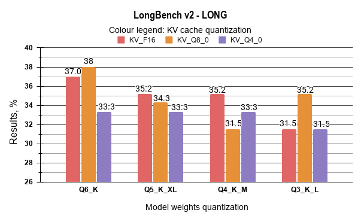
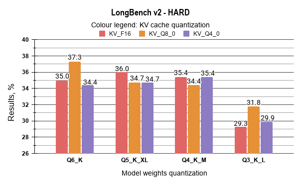
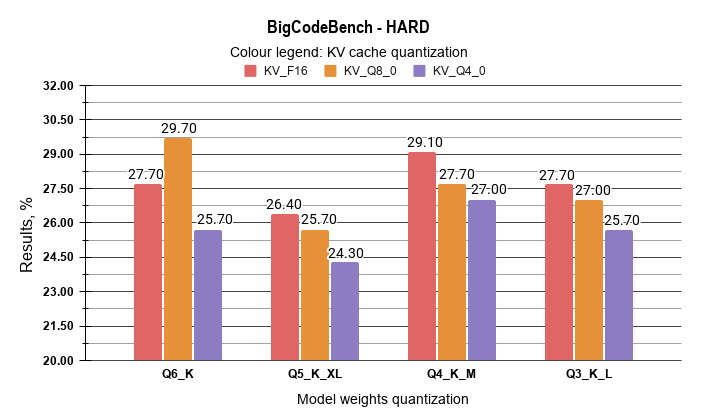
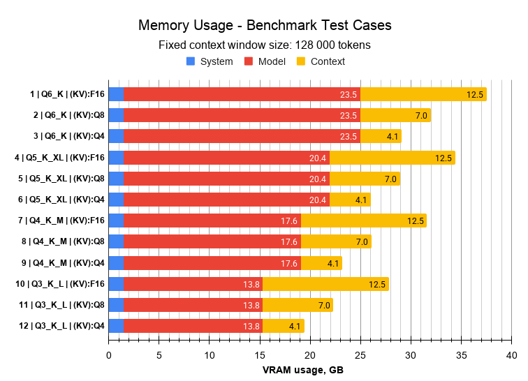

## Memory-Constrained Quantization Analysis of Qwen3-Coder-30B: Balancing Reasoning Integrity and Extended Context Capacity

**Piotr Jażdżyk**   
[https://github.com/pjazdzyk](https://github.com/pjazdzyk)  
[https://www.linkedin.com/in/pjazdzyk/](https://www.linkedin.com/in/pjazdzyk/)  
[https://energyflowx.com](https://energyflowx.com)

### 15 March 2026

## Table of Contents

[Abstract](#abstract) 
[1. Introduction](#1-introduction) 
[2. Technical background](#2-technical-background) 
  &nbsp;&nbsp;[2.1 VRAM usage optimization](#21-vram-usage-optimization) 
  &nbsp;&nbsp;[2.2 Qwen3-Coder - analyzed model](#22-qwen3-coder---analyzed-model) 
  &nbsp;&nbsp;[2.3 Benchmarking suites](#23-benchmarking-suites) 
[3. Methodology: Test Bench & Configuration](#3-methodology-test-bench--configuration) 
  &nbsp;&nbsp;[3.1 Hardware and Software Environment](#31-hardware-and-software-environment) 
  &nbsp;&nbsp;[3.2 Execution procedure](#32-execution-procedure) 
  &nbsp;&nbsp;[3.3 Experiment plan - quantization Matrix](#33-experiment-plan---quantization-matrix) 
[4. Performance Evaluation Metrics](#4-performance-evaluation-metrics) 
[5. Results and Discussion](#5-results-and-discussion) 
  &nbsp;&nbsp;[5.1 LongBench-v2 benchmark result analysis](#51-longbench-v2-benchmark-result-analysis) 
  &nbsp;&nbsp;[5.2 BigCodeBench benchmark result analysis](#52-bigcodebench-benchmark-result-analysis) 
  &nbsp;&nbsp;[5.3 VRAM memory usage and max context size estimation](#53-vram-memory-usage-and-max-context-size-estimation) 
  &nbsp;&nbsp;[5.4 Inference Performance Analysis](#54-inference-performance-analysis) 
  &nbsp;&nbsp;[5.5 Comparative Analysis and performance evaluation](#55-comparative-analysis-and-performance-evaluation) 
[6. Conclusions](#6-conclusions) 
[7. References](#7-references) 

### **Abstract**

This technical report investigates the impact of model weight and KV cache quantization on the performance of the **Qwen3-Coder-30B** model under extended context conditions. Experiments were conducted using a fixed **128 000** token context window on a **32GB** consumer-grade GPU. The results reveal several unexpected performance characteristics. In particular, 8-bit KV cache quantization (Q8\_0) scores slightly higher than FP16 baseline across both LongBench-v2 and BigCodeBench metrics. Furthermore, Q4\_K\_M weights demonstrate stronger reasoning integrity than the less aggressive Q5\_K\_XL quantization. While Q3\_K\_L remains the only configuration capable of fully supporting a 256k context window, it introduces measurable performance degradation, with the exception of the Q3\_K\_L / Q8\_0 KV combination which performs unexpectedly well in the LongBench “long” category. Overall, the configuration combining Q4\_K\_M weights with Q8\_0 KV cache emerges as a practical sweet spot, enabling an estimated 225 000 token context capacity while maintaining accuracy above the FP16 baseline.

### **1\. Introduction**

Since the public release of ChatGPT in 2022, Large Language Models (LLMs) have been rapidly adopted by the IT industry, becoming an integral part of the software development landscape. From humble beginnings as simple chat interfaces, LLMs are now the foundational building blocks of numerous coding tools, client applications and agents. However, along with widespread usage, a lot of security and privacy concerns are arising.   
One of the alternatives for smaller companies may be hosting isolated local LLMs using consumer-grade hardware, while accepting certain compromises and limitations. One of these is the limited VRAM capacity available in consumer grade GPUs, which consequently allows the use of only small or medium-sized quantized models (up to 30B+ parameters). Choosing a larger model often means less space for the context window, which must be of a reasonable size when using an LLM in agentic coding applications.  
There are a couple of techniques a user can resort to when trying to reduce VRAM memory usage at the expense of potential accuracy degradation, for example: using a model with the same parameter count but lower weight precision, and lowering the key-value (KV) cache quantization precision.   
This study aims to identify the optimal trade-off between quantization levels and accuracy, ensuring the most efficient utilization of the **32GB** GPU capabilities with the **Qwen3-Coder-30B** model, avoiding the hardware bottlenecks and maintaining reasonable inference speed.

###  **2\. Technical background**

Before diving deep into the benchmark results, it is essential to briefly explain the technical background behind these memory saving concepts.

#### **2.1 VRAM usage optimization**

**Weight Quantization** is the process of reducing the precision of the model's static parameters from their original FP16/BF16 format to lower bit-depths. This approach significantly reduces the VRAM required to simply load the model into memory \[1\]. However, as noted in comprehensive surveys of low-bit LLMs, pushing quantization to aggressive levels often leads to a degradation in the model's response capabilities \[2\]. The 'Q' prefix denotes quantization of weights from native FP16 to 3–8 bit integers using scaling and grouping to minimize information loss. Suffixes '0' or '1' represent legacy formats, while 'K' (K-quants) signifies the modern, recommended standard for balancing compression and accuracy \[3\].  
**KV Cache Quantization** addresses the dynamic memory used to store the Key and Value vectors generated during inference \[4\]. At a large context of 128 000 tokens, using standard precision would easily exceed the 32GB VRAM limit of the GPU. By lowering the KV cache precision to Q8\_0 or Q4\_0, memory pressure on the GPU can be significantly decreased \[1,4\].  
Beyond weight or KV cache quantization, other memory management strategies are often employed when hardware limits are reached:  
a) **System RAM Fallback**: Modern GPU drivers and inference backends may utilize system RAM when VRAM capacity is exceeded. In this mode, model parameters or intermediate tensors must be transferred between system memory and GPU memory over the PCIe bus. While this mechanism prevents OOM crashes, the PCIe bandwidth may become a severe bottleneck, drastically reducing tokens-per-second (TPS) throughput.  
b) **CPU Offloading**: Some inference engines allow a subset of model layers to be executed on the CPU while the remaining layers remain on the GPU. This approach enables models larger than available VRAM to run, but introduces a performance penalty because CPUs are significantly less efficient than GPUs at large-scale tensor operations. However, it can still perform better than system memory fallback, as only intermediate activation tensors must be transferred across the PCIe bus rather than repeatedly moving large model weight matrices.

#### **2.2 Qwen3-Coder \- analyzed model**

Qwen3-Coder is a family of models dedicated mainly to programming tasks and agentic coding, supporting 358 coding languages and function calling (tools), while retaining its capability for general, conversational, and mathematical tasks. It is designed to support long context windows of up to 256k tokens \[5\]. The base version with 480B parameters (Qwen3-Coder-480B-A35B-Instruct) is far too large for consumer-grade hardware, but the 30B version (Qwen3-Coder-30B-A3B-Instruct) is a compelling alternative for use on a single 32GB GPU or equivalent hardware (eg. 2x24, 2x16). This model is available in various quantization levels, but effectively, only quantized models like Q6\_K or below can be considered when working within the 32GB VRAM limit of a single GPU.  
Numerous benchmarks and comparisons are available for this model. Some are aggregated in comprehensive charts, such as those presented by Artificial Analysis portal \[6\], which help in understanding how the analyzed model compares to its peers in terms of coding proficiency and reasoning.  
All quantized variants of the Qwen3-Coder-30B model used in this study were sourced via LM Studio in GGUF format.

#### **2.3 Benchmarking suites**

To evaluate the impact of quantization on the model's performance, two distinct benchmarking tools were utilized, each targeting a different aspect of LLM capability.  
**LongBench-v2:** As context windows expand, assessing a model's ability to retrieve and process information from vast datasets becomes critical. LongBench-v2 is specifically designed to evaluate deep, long-context understanding. It consists of 503 challenging multiple-choice questions, with contexts ranging from 8k to 2M words. The benchmark covers several task categories: single-document QA, multi-document QA, long in-context learning, long-dialogue history understanding, code repository understanding, and long structured data understanding \[7\]. This benchmark is crucial for evaluating how KV Cache quantization affects the model's response accuracy and identifying potential performance cliffs under aggressive quantization settings.  
**BigCodeBench:** This is a rigorous benchmark designed to evaluate the practical coding capabilities of LLMs. Unlike simpler tests, it requires the model to utilize multiple library functions and complex logic to solve programming tasks \[8\]. In this study, BigCodeBench is used to determine the potential degradation of "model intelligence" and reasoning during advanced coding assignments in different languages for different model weights and KV cache quantizations.

### **3\. Methodology: Test Bench & Configuration**

The primary goal of this methodology was to ensure a deterministic and reproducible testing environment, allowing for a fair comparison between various quantization levels.

**3.1 Hardware and Software Environment** 

All tests were performed on a local workstation:

* GPU: NVIDIA GeForce RTX 5090 (32GB VRAM)   
* CPU: Intel Core i9-9960X (16 cores, overclocked to 4.8 GHz)  
* RAM: 128GB DDR4 XMP (3000 MHz) in Quad-channel configuration.  
* System Bus: PCIe 3.0 x16. While the RTX 5090 supports higher standards, the PCIe 3.0 interface on the X299 platform provides a unique opportunity to observe the impact of bus bandwidth and to determine to what extent older-gen platforms can utilize the power of modern GPUs.  
* OS: Windows 11 Pro with WSL2 (Ubuntu 22.04 LTS)  
* BIOS settings:  "Above 4G Decoding" and "Resizable BAR"

Software configuration and drivers

* Inference Engine: LM Studio v0.3.39.  
* Model Variant: Qwen3-Coder-30B-A3B-Instruct (GGUF format).  
* Sampling Settings: A temperature of 0 for more deterministic results  
* GPU drivers: NVIDIA GeForce Game Ready Driver (GRD) v591.86  
* CUDA 12 llama.cpp: v1.104.2

Benchmark configuration:

1) **LongBench (v2)**  
* Mode: Zero-Shot, (cot=false, rag=0)  
* maxLen: 120 000 (slightly lower than max context size, to leave some room for the response)  
* N\_proc: 1 (sequential)  
* Run script: All changes are provided in the test repository file: [pred\_new.py](https://github.com/pjazdzyk/articles/tree/main/2026-02-qwen3-kv-cache-quantization/data/1_LongBench-v2).  
  \- added instruction at the end of challenge prompt, to ensure model concise response (time and energy savings).   
  \- set temperature to 0 for non-cot runs,  
2) **BigCodeBench (v0.2.4)**  
* Mode: Instruct, greedy decoding  
* HARD (focusing on the most demanding coding tasks).

**3.2 Execution procedure**

* Full VRAM Purge: The model was completely ejected from memory before each test.  
* If required memory could not fit in GPU, a CPU offloading strategy was used,  
* Context Initialization: The context window was fixed at 128 000 tokens to maintain a consistent memory footprint for the KV Cache.  
* Monitoring: System memory and VRAM utilization were monitored to identify when the system resorted to CPU Offloading or Shared Memory Fallback.  
* Monitoring tools: nvitop 1.3.2, HwMonitor 1.62.0

**3.3 Experiment plan \- quantization Matrix**

The study utilized a cross-testing approach between model weights and KV cache precisions. Each model quantization was tested against all three KV.

Table 1: Experiment plan matrix

| No. | Weights  quantization | KV Cache quantization |
| :---: | :---: | :---: |
|  |  |  |
| 1 | Q6\_K | F16 |
| 2 | Q6\_K | Q8\_0 |
| 3 | Q6\_K | Q4\_0 |
| 4 | Q5\_K\_XL | F16 |
| 5 | Q5\_K\_XL | Q8\_0 |
| 6 | Q5\_K\_XL | Q4\_0 |
| 7 | Q4\_K\_M | F16 |
| 8 | Q4\_K\_M | Q8\_0 |
| 9 | Q4\_K\_M | Q4\_0 |
| 10 | Q3\_K\_L | F16 |
| 11 | Q3\_K\_L | Q8\_0 |
| 12 | Q3\_K\_L | Q4\_0 |

Initial tests indicated that for provided setup benchmark results are the same on each attempt for each case. All runs were repeated at least 2-3 times, to ensure result consistency.

### **4\. Performance Evaluation Metrics**

The objective of this study is to identify the optimal trade-off between model weight quantization and KV cache precision. The desired configuration should minimize VRAM consumption while preserving reasoning performance and long-context retrieval capability. Both benchmarks used in this study LongBench-v2 and BigCodeBench report performance as the percentage of successfully completed tasks. Since all benchmark outputs are expressed on a uniform percentage scale, results can be directly aggregated using a weighted linear combination. The composite weighted accuracy score ‘A’ is defined as:

$$
A = \sum_{i=1}^{n} w_i x_i
$$

with

$$
\sum_{i=1}^{n} w_i = 1
$$

Where:  
i - number of evaluated benchmark components,  
𝓌 - weight assigned to the i-th benchmark,  
x - accuracy score (%) of the i-th benchmark.

Weights assumed in this study are listed below:

$$
w_{LH} = 0.333\quad w_{LL} = 0.333\quad w_{BH} = 0.333
$$

Where:  
𝓌_LH - LongBench Hard,  
𝓌_LL - LongBench Long,  
𝓌_BH - BigCodeBench Hard

This metric captures ‘intelligence’ performance per unit of memory. To measure relative performance loss with respect to the full-precision baseline, a degradation ratio ‘D’ is defined as:

$$
D = \frac{A_{case}}{A_{base}}
$$

Where:  
A_base - represents the weighted score of base case result,  
A_case - represents the weighted score of the evaluated case result

To jointly evaluate benchmark results in correlation with memory consumption, we define the Intelligence Density (ID):

$$
ID = \frac{A_{case}}{VRAM_{total}}
$$

Where:  
A_{case} - represents the weighted score of the evaluated case result  
VRAM_{total} - total VRAM memory used for analyzed test case in GB

### **5\. Results and Discussion**

**5.1 LongBench-v2 benchmark result analysis**

The results from the LongBench-v2 benchmark are presented in the tables below. LongBench-v2 categorizes outcomes by task type and context length. From the perspective of analyzing model degradation, the **"Hard"** and **"Long"** task groups deserve special attention, as they represent the most demanding scenarios for both the model's reasoning capabilities and higher potential for degradation due to heavy quantization. Model context size was set as: fixed **128 000\.** The ‘Delta’ column quantifies the performance difference by comparing each configuration's results against the baseline.

Table 2: **LongBenchV2** results analysis: **Easy**, **Short** and **Medium** tasks.

| No. | Weight quant. | KV Cache quant | RESULTS % |  |  |  |  |  |
| :---: | :---: | :---: | :---: | :---: | :---: | :---: | :---: | :---: |
|  |  |  | **Easy** | **Delta, (vs LP1)** | **Short** | **Delta, (vs LP1)** | **Medium** | **Delta, (vs LP1)** |
| 1 | Q6\_K | F16 | 43.8 | (base) | 41.7 | (base) | 36.3 | (base) |
| **2** | **Q6\_K** | **Q8\_0** | **41.7** | **\-2.1** | **42.8** | **1.1** | **36.3** | **0** |
| 3 | Q6\_K | Q4\_0 | 39.1 | \-4.7 | 42.8 | 1.1 | 32.1 | \-4.2 |
| 4 | Q5\_K\_XL | F16 | 41.7 | \-2.1 | 43.3 | 1.6 | 35.3 | \-1 |
| 5 | Q5\_K\_XL | Q8\_0 | 41.7 | \-2.1 | 42.2 | 0.5 | 34.9 | \-1.4 |
| 6 | Q5\_K\_XL | Q4\_0 | 40.6 | \-3.2 | 45 | 3.3 | 32.1 | \-4.2 |
| 7 | Q4\_K\_M | F16 | 40.6 | \-3.2 | 41.7 | 0 | 34.9 | \-1.4 |
| 8 | Q4\_K\_M | Q8\_0 | 40.1 | \-3.7 | 40.6 | \-1.1 | 35.8 | \-0.5 |
| **9** | **Q4\_K\_M** | **Q4\_0** | **43.2** | **\-0.6** | **43.3** | **1.6** | **36.7** | **0.4** |
| 10 | Q3\_K\_L | F16 | 40.6 | \-3.2 | 40 | \-1.7 | 29.3 | \-7 |
| 11 | Q3\_K\_L | Q8\_0 | 42.2 | \-1.6 | 41.7 | 0 | 31.2 | \-5.1 |
| 12 | Q3\_K\_L | Q4\_0 | 37.0 | \-6.8 | 36.7 | \-5 | 29.8 | \-6.5 |

Table 3: **LongBenchV2** results analysis: **Hard** and **Long**

| No. | Weight quant. | KV Cache quant. | RESULTS % |  |  |  |
| :---: | :---: | :---: | :---: | :---: | :---: | :---: |
|  |  |  | **Hard** | **Delta, (vs LP1)** | **Long** | **Delta, (vs LP1)** |
| 1 | Q6\_K | F16 | 35.0 | (base) | 37 | (base) |
| **2** | **Q6\_K** | **Q8\_0** | **37.3** | **2.3** | **38** | **1** |
| 3 | Q6\_K | Q4\_0 | 34.4 | \-0.6 | 33.3 | \-3.7 |
| **4** | **Q5\_K\_XL** | **F16** | **36.0** | **1.0** | **35.2** | **\-1.8** |
| 5 | Q5\_K\_XL | Q8\_0 | 34.7 | \-0.3 | 34.3 | \-2.7 |
| 6 | Q5\_K\_XL | Q4\_0 | 34.7 | \-0.3 | 33.3 | \-3.7 |
| **7** | **Q4\_K\_M** | **F16** | **35.4** | **0.4** | **35.2** | **\-1.8** |
| 8 | Q4\_K\_M | Q8\_0 | 34.4 | \-0.6 | 31.5 | \-5.5 |
| 9 | Q4\_K\_M | Q4\_0 | 35.4 | 0.4 | 33.3 | \-3.7 |
| 10 | Q3\_K\_L | F16 | 29.3 | \-5.7 | 31.5 | \-5.5 |
| **11** | **Q3\_K\_L** | **Q8\_0** | **31.8** | **\-3.2** | **35.2** | **\-1.8** |
| 12 | Q3\_K\_L | Q4\_0 | 29.9 | \-5.1 | 31.5 | \-5.5 |

As expected, the results show signs of accuracy degradation as model weights and KV cache are more aggressively quantized. However, this decline is non-linear, and several counter-intuitive anomalies were observed, which can be observed more easily on charts below:

The analysis of the LongBench-v2 results demonstrates that moderate quantization levels maintain a high degree of performance consistency. It has been identified that the Q6\_K / Q8\_0 KV configuration (Case 2\) achieved the most robust results, with a score of 37.3% in the "Hard" category and 38.0% in the "Long" category, representing a marginal improvement over the FP16 baseline.
When comparing medium-bit quantization levels, the data indicates that the performance gap between Q5\_K\_XL and Q4\_K\_M is negligible across most LongBench-v2 categories. For instance, in "Hard" reasoning tasks, Q5\_K\_XL (F16 KV) achieved a score of 36.0%, while Q4\_K\_M (F16 KV) followed closely at 35.4%. Given the lower VRAM footprint of Q4\_K\_M, it is identified as a more resource-efficient alternative for 32GB hardware deployments, as it allows for significantly larger active context windows without incurring a substantial penalty in reasoning accuracy.  
A notable observation was recorded regarding the Q3\_K\_L quantization. While a performance drop is evident in complex logic ("Hard" tasks, where scores fall to approximately 29–31%), this configuration exhibited a high degree of retrieval resilience. In the "Long" category, Case 11 (Q3\_K\_L / Q8\_0 KV) achieved a score of 35.2%, which is comparable to the results of the significantly larger Q5 and Q4 models. This suggests that the model’s ability to process and retrieve information from long sequences is less sensitive to aggressive weight quantization than its high-level reasoning capabilities. Consequently, Q3\_K\_L is identified as a viable option for tasks primarily focused on extensive document retrieval.

**5.2 BigCodeBench benchmark result analysis**

The results from the BigCodeBench benchmark are summarised in the table below. Model context size was set as: 128 000 for consistency, however most of the tasks in this test suite can be solved with a smaller context window.

Table 4: BigCodeBench results summary

| No. | Model | Context | RESULTS |  |
| :---: | :---: | :---: | :---: | :---: |
|  | **Weight quant.** | **KV Cache quant** | **Pass@1 (%)** | **Delta, (vs LP1)** |
| 1 | Q6\_K | F16 | 27.7 | (base) |
| **2** | **Q6\_K** | **Q8\_0** | **29.7** | **2.0** |
| 3 | Q6\_K | Q4\_0 | 25.7 | \-2.0 |
| 4 | Q5\_K\_XL | F16 | 26.4 | \-1.3 |
| 5 | Q5\_K\_XL | Q8\_0 | 25.7 | \-2.0 |
| 6 | Q5\_K\_XL | Q4\_0 | 24.3 | \-3.4 |
| **7** | **Q4\_K\_M** | **F16** | **29.1** | **1.4** |
| **8** | **Q4\_K\_M** | **Q8\_0** | **27.7** | **0.0** |
| 9 | Q4\_K\_M | Q4\_0 | 27.0 | \-0.7 |
| **10** | **Q3\_K\_L** | **F16** | **27.7** | **0.0** |
| 11 | Q3\_K\_L | Q8\_0 | 27.0 | \-0.7 |
| 12 | Q3\_K\_L | Q4\_0 | 25.7 | \-2.0 |

The analysis of BigCodeBench results indicates that the impact of quantization on coding tasks is non-linear. It has been observed that the Q6\_K / Q8\_0 KV configuration (Case 2\) achieved a Pass@1 score of 29.7%, a 2.0% improvement over the FP16 baseline. This suggests that 8-bit KV cache quantization does not degrade performance while allowing for significant VRAM savings.  
Regarding medium-bit weights, the data reveals that Q4\_K\_M outperforms Q5\_K\_XL. The Q4\_K\_M variant achieved 29.1%, while Q5\_K\_XL scores ranged between 24.3% and 26.4%. This suggests that the Q4\_K\_M format is better optimized for the Qwen3-Coder architecture's instruction-following capabilities. 

Additionally, Q3\_K\_L quantization remains competitive in code generation. With scores between 27.0% and 27.7%, it performs similarly to the FP16 baseline with the exception of KV Q8\_0, where decrease is observed over the Q6\_K model case. This indicates that the loss of precision in 3-bit weights is less significant in coding than in general reasoning. Consequently, Q3\_K\_L is identified as a reliable option for agentic workflows requiring maximum context on 32GB hardware.

**5.3 VRAM memory usage and max context size estimation**

Below are presented results from memory usage for each test case. Some cases exceed available VRAM memory, therefore partial layer offloading to system RAM and CPU computation was required, to ensure test feasibility. In each test case, context size was fixed as 128 000 tokens. 

Table 5: VRAM memory usage summary

| TEST CASE |  |  | VRAM MEMORY USAGE ESTIMATION, GB |  |  |  |  |  | OFFLOAD |
| :---: | :---: | :---: | :---: | :---: | :---: | :---: | :---: | :---: | :---: |
| **No.** | **Weight quant.** | **KV Cache quant** | **Sys** | **Model** | **Context \+ KV Cache** | **Total** | **Avail- able** | **Saved** | **Layers on GPU (offload)** |
| 1 | Q6\_K | F16 | 1.5 | 23.5 | 12.5 | 37.5 | 31.84 | 0 | 39/48 |
| 2 | Q6\_K | Q8\_0 | 1.5 | 23.5 | 7 | 32 | 31.84 | 5.5 | 46/48 |
| 3 | Q6\_K | Q4\_0 | 1.5 | 23.5 | 4.1 | 29.1 | 31.84 | 8.4 | 48/48 |
| 4 | Q5\_K\_XL | F16 | 1.5 | 20.4 | 12.5 | 34.4 | 31.84 | 3.1 | 42/48 |
| 5 | Q5\_K\_XL | Q8\_0 | 1.5 | 20.4 | 7 | 28.9 | 31.84 | 8.6 | 48/48 |
| 6 | Q5\_K\_XL | Q4\_0 | 1.5 | 20.4 | 4.1 | 26 | 31.84 | 11.5 | 48/48 |
| 7 | Q4\_K\_M | F16 | 1.5 | 17.6 | 12.5 | 31.6 | 31.84 | 5.9 | 47/48 |
| 8 | Q4\_K\_M | Q8\_0 | 1.5 | 17.6 | 7 | 26.1 | 31.84 | 11.4 | 48/48 |
| 9 | Q4\_K\_M | Q4\_0 | 1.5 | 17.6 | 4.1 | 23.2 | 31.84 | 14.3 | 48/48 |
| 10 | Q3\_K\_L | F16 | 1.5 | 13.8 | 12.5 | 27.8 | 31.84 | 9.7 | 48/48 |
| 11 | Q3\_K\_L | Q8\_0 | 1.5 | 13.8 | 7 | 22.3 | 31.84 | 15.2 | 48/48 |
| 12 | Q3\_K\_L | Q4\_0 | 1.5 | 13.8 | 4.1 | 19.4 | 31.84 | 18.1 | 48/48 |

Max usable VRAM is 31.84 GB.   Values marked in red are cases where available memory was exceeded and partial layer offload to CPU and system memory was required.

Estimation of maximum possible context size per case is provided in the table below:

Table 6: Maximum context size estimation

| No. | Weight quant. | KV Cache quant | Max Fitting Size | % of max size |
| :---: | :---: | :---: | :---: | :---: |
| 1 | Q6\_K | F16 | 62000 | 23.7% |
| 2 | Q6\_K | Q8\_0 | 105000 | 40.1% |
| 3 | Q6\_K | Q4\_0 | 200000 | 76.3% |
| 4 | Q5\_K\_XL | F16 | 98000 | 37.4% |
| 5 | Q5\_K\_XL | Q8\_0 | 170000 | 64.8% |
| **6** | **Q5\_K\_XL** | **Q4\_0** | **262144** | **100.0%** |
| 7 | Q4\_K\_M | F16 | 122000 | 46.5% |
| **8** | **Q4\_K\_M** | **Q8\_0** | **225000** | **85.8%** |
| **9** | **Q4\_K\_M** | **Q4\_0** | **262144** | **100.0%** |
| 10 | Q3\_K\_L | F16 | 166000 | 63.3% |
| **11** | **Q3\_K\_L** | **Q8\_0** | **262144** | **100.0%** |
| **12** | **Q3\_K\_L** | **Q4\_0** | **262144** | **100.0%** |

The proposed maximum context sizes are calculated based on near-total VRAM saturation. In practice, these values may need to be reduced by a safety margin of 2–5%, depending on workstation specific usage. Some applications, such as web browsers, IDEs, or graphical system processes, can consume additional video memory, potentially triggering performance-degrading offloading if the limit is exceeded.

**5.4  Inference Performance Analysis**

Although the NVIDIA RTX 5090 is one of the most powerful consumer-grade GPUs available, inference speed is strictly bottlenecked by VRAM capacity. When a model fails to fit entirely within the VRAM, the performance does not degrade linearly. It exhibits a binary "cliff" effect, decreasing by a factor of 20 to 60 on the test workstation.  
To quantify this hardware bottleneck, all 12 test cases were individually benchmarked for inference speed. The tests utilized processing of a massive context prompt consisting of 113 667 tokens, which included five complex code snippets. The model was tasked with analyzing the code, summarizing its functionality, and generating corresponding unit tests. The quality analysis was not a subject of this evaluation, only measuring the raw speed. The prefill (prompt evaluation) and decoding (token generation) speeds were extracted directly from the LM Studio engine logs. The results are detailed in Table 7\.

Table 7: Inference speed results

| No. | Weight quant. | KV Cache quant | Layers on GPU (offload) | Prefill Speed t / s | Decoding Speed t / s |
| :---: | :---: | :---: | :---: | :---: | :---: |
| 1 | Q6\_K | F16 | 39/48 | 565.28 | 1.81 |
| 2 | Q6\_K | Q8\_0 | 46/48 | 1029.72 | 6.41 |
| 3 | Q6\_K | Q4\_0 | 48/48 | 1581.26 | 40.25 |
| 4 | Q5\_K\_XL | F16 | 42/48 | 749.86 | 3.68 |
| 5 | Q5\_K\_XL | Q8\_0 | 48/48 | 1607.08 | 45.65 |
| 6 | Q5\_K\_XL | Q4\_0 | 48/48 | 1605.89 | 40.31 |
| 7 | Q4\_K\_M | F16 | 47/48 | 1377.29 | 7.88 |
| 8 | Q4\_K\_M | Q8\_0 | 48/48 | 1621.40 | 47.25 |
| 9 | Q4\_K\_M | Q4\_0 | 48/48 | 1626.93 | 39.94 |
| 10 | Q3\_K\_L | F16 | 48/48 | 2011.42 | 74.96 |
| 11 | Q3\_K\_L | Q8\_0 | 48/48 | 1575.14 | 46.31 |
| 12 | Q3\_K\_L | Q4\_0 | 48/48 | 1594.55 | 40.44 |

The data clearly demonstrates that in every case where CPU layer offloading was required (LP 1, 2, and 4), the decoding speed dropped to critically low values. While a decoding speed of 5-8 t/s (as seen in LP 2\) might be considered a low comfort minimum for simple, human-read chat interfaces, it is definitely too slow for modern, agentic coding tools that rely on rapid, multi-step code generation.  
To further illustrate the severity of the PCIe bus bottleneck, test case LP1 was repeated strictly without CPU offloading. This forced the inference engine to rely entirely on Shared System Memory (where the GPU performs calculations but fetches raw weights from the system RAM). The results were catastrophic: the prefill phase alone lasted over two and a half hours (02:36:14 | 11.8 t/s), and the decoding speed dropped to **0.67 t/s**.  
This extreme speed degradation provides a critical hardware engineering guideline: in worst-case scenarios where exceeding VRAM is unavoidable, it is significantly more efficient to explicitly offload compute layers to the CPU rather than allowing the system to default to shared memory fallback.   
It should be noted that the severity of this bottleneck is partially influenced by the PCIe 3.0 interface of the test bench; systems equipped with PCIe 4.0 or 5.0 might see slightly higher offloading speeds, though the “memory clif effect” remains a fundamental limitation

**5.5 Comparative Analysis and performance evaluation**

The derived scoring metrics are presented in the table below. The Hard and Long components from the LongBench suite were deliberately isolated for this analysis, as the primary objective of this study is to evaluate performance under the most context-demanding and reasoning-intensive conditions. Furthermore, the Hard subset from the BigCodeBench framework has been integrated into the scoring system. This selection focuses the evaluation on the most demanding test components potentially most prone to more aggressive quantizations. 

Table 8: Final outcome with score results

| No. | Weight quant. | KV cache quant. | LongBench |  | BigCode- Bench | Weighted Result (A) | Degrada- tion Ratio (D) | Total VRAM GB | Intelli \-gence density (ID) |
| :---: | :---: | :---: | :---: | :---: | :---: | :---: | :---: | :---: | :---: |
|  |  |  | **Hard w=0.33** | **Long w=0.33** | **Hard w=0.33** |  |  |  |  |
| 1 | Q6\_K | F16 | 35.0 | 37 | 27.7 | 33.20 | 1.00 | 37.50 |  0.89  |
| 2 | Q6\_K | Q8\_0 | 37.3 | 38 | 29.7 | 34.97 | 1.05 | 32.00 | 0.93 |
| 3 | Q6\_K | Q4\_0 | 34.4 | 33.3 | 25.7 | 31.10 | 0.94 | 29.10 | 0.83 |
| 4 | Q5\_K\_XL | F16 | 36.0 | 35.2 | 26.4 | 32.50 | 0.98 | 34.40 | 0.87 |
| 5 | Q5\_K\_XL | Q8\_0 | 34.7 | 34.3 | 25.7 | 31.54 | 0.95 | 28.90 | 0.84 |
| 6 | Q5\_K\_XL | Q4\_0 | 34.7 | 33.3 | 24.3 | 30.74 | 0.93 | 26.00 | 0.82 |
| 7 | Q4\_K\_M | F16 | 35.4 | 35.2 | 29.1 | 33.20 | 1.00 | 31.60 | **0.89**  |
| 8 | Q4\_K\_M | Q8\_0 | 34.4 | 31.5 | 27.7 | 31.17 | 0.94 | 26.10 | 0.83 |
| 9 | Q4\_K\_M | Q4\_0 | 35.4 | 33.3 | 27.0 | 31.87 | 0.96 | 23.20 | **0.85**  |
| 10 | Q3\_K\_L | F16 | 29.3 | 31.5 | 27.7 | 29.47 | 0.89 | 27.80 | 0.79 |
| 11 | Q3\_K\_L | Q8\_0 | 31.8 | 35.2 | 27.0 | 31.30 | 0.94 | 22.30 | **0.83**  |
| 12 | Q3\_K\_L | Q4\_0 | 29.9 | 31.5 | 25.7 | 29.00 | 0.87 | 19.40 | 0.77 |

Configurations with an Intelligence Density (ID) \> 0.85 are marked as top recommendations. Yellow cells highlight setups achieving the highest benchmark scores, such as Q6\_K / Q8\_0, which paradoxically outperforms the baseline. However, these configurations require a reduced context window to remain within 32GB VRAM and avoid inference slowdown (see table 6). Specifically, the maximum context for Q6\_K / Q8\_0 must be limited to approximately 100500 tokens to prevent memory offloading. Green cells indicate high-performing setups, such as Q4\_K\_M, that remain strictly within the 32GB limit at 128k context, offering the potential for even larger windows. Notably, Q4\_K\_M is identified as more efficient than Q5\_K\_XL, providing higher coding scores and better VRAM headroom. Speed results are excluded from the scoring, as performance remains stable until the VRAM threshold is crossed, at which point decoding speed collapses to unusable levels (table 7).

### **6\. Conclusions**

This study evaluated twelve deployment scenarios combining four model weight quantization levels with three KV cache precision variants. Using the proposed weighted accuracy, degradation ratio, and intelligence density metrics, the configurations were compared under a 128 000  context window size and 32GB VRAM constraint.  
The results reveal a clear trade-off rather than a single dominant configuration, though certain unexpected performance gains were identified. Two practically viable groups of configurations emerge. The first group prioritizes maximum intelligence. Configurations such as **Q6\_K** with **Q8\_0 KV** precision achieve the highest composite benchmark scores, even surpassing the FP16 baseline. However, on 32GB hardware, these setups require a reduced maximum context window (approximately 100 500 tokens) to prevent memory overflow and dramatic inference slowdown caused by KV cache offloading.  
The second group accepts a marginal performance trade-off in exchange for substantially greater context capacity. Configurations based on **Q4\_K\_M** weights enable operation with significantly larger context windows fully contained within GPU VRAM. Notably, the data indicates that **Q4\_K\_M** often outperforms the less aggressive **Q5\_K\_XL** in coding tasks, while providing better VRAM headroom. This makes Q4-based setups a highly efficient choice for general deployment.  
This trade-off is particularly relevant for agentic workflows and long-context reasoning systems. In such scenarios, the ability to process substantially longer input sequences often outweighs modest differences in benchmark scores. Finally, while configurations utilizing **Q3\_K\_L** weights exhibit greater degradation in complex logic, they remain surprisingly resilient in long-context retrieval tasks, making them an option to consider for memory-restricted environments or maximum-scale document analysis.  
	These observations should be interpreted as preliminary engineering results rather than definitive conclusions. Further investigation across additional hardware platforms, repeated benchmark runs, and alternative inference backends would be required to determine whether the observed advantages of certain quantization configurations persist under broader experimental conditions.  
These results are specific to the evaluated model and benchmark setup. Different architectures may exhibit different sensitivity patterns to weight and KV cache quantization. Further empirical validation across additional models and tasks is recommended.

All raw benchmark results are available at the source data: [article\_repository](https://github.com/pjazdzyk/articles/tree/main/2026-02-qwen3-kv-cache-quantization).

**Acknowledgements:**   
This report was prepared with the support of Gemini (a large language model by Google) in the areas of English language refinement, technical discussion of the results, and the clarification of complex machine learning concepts.   
It is important to note that the original research concept, experimental design, methodology, final data interpretation, and conclusions were independently developed and provided by the author. All experimental oversight and the logical framework of this study are the work of the author.

### **7\. References**

\[**1**\] "Quantization Explained," *LocalLLM Blog*, 2024\. \[Online\]. Available: [https://localllm.in/blog/quantization-explained](https://localllm.in/blog/quantization-explained). Accessed: Feb. 20, 2026\.  
\[**2**\] J. Xu et al., "A Survey of Low-bit Large Language Models: Basics, Systems, and Algorithms," *arXiv preprint arXiv:2409.16694*, 2024\.  
\[**3**\] P. Ilvez, "Demystifying LLM Quantization Suffixes: What Q4\_K\_M, Q8\_0, and Q6\_K Really Mean," *Medium*, 2025\. \[Online\]. Available: [https://medium.com/@paul\_ilvez/demystifying-llm-quantization-suffixes-q4-k-m-q8-0-q6-k-really-mean](https://www.google.com/search?q=https://medium.com/%40paul_ilvez/demystifying-llm-quantization-suffixes-q4-k-m-q8-0-q6-k-really-mean). Accessed: Feb. 20, 2026\.  
\[**4**\] "KV Cache Documentation," *Hugging Face Transformers Documentation*, 2024\. \[Online\]. Available: [https://huggingface.co/docs/transformers/main/kv\_cache](https://huggingface.co/docs/transformers/main/kv_cache). Accessed: Feb. 22, 2026\.  
\[**5**\] Qwen Team, "Qwen3-Coder Repository," *GitHub*, 2026\. \[Online\]. Available: [https://github.com/QwenLM/Qwen3-Coder](https://github.com/QwenLM/Qwen3-Coder).  
\[**6**\] "Qwen3-Coder-30B-A3B-Instruct Model Analysis," *Artificial Analysis*, 2026\. \[Online\]. Available: [https://artificialanalysis.ai/models/qwen3-coder-30b-a3b-instruct](https://artificialanalysis.ai/models/qwen3-coder-30b-a3b-instruct). Accessed: Feb. 22, 2026\.  
\[**7**\] Y. Bai et al., "LongBench v2: Towards Deeper Understanding and Reasoning on Realistic Long-context Multitasks," *arXiv preprint arXiv:2412.15204*, 2024\.  
\[**8**\] T. Y. Zhuo et al., "BigCodeBench: Benchmarking Code Generation with Diverse Function Calls and Complex Instructions," *arXiv preprint arXiv:2406.15877*, 2024\.